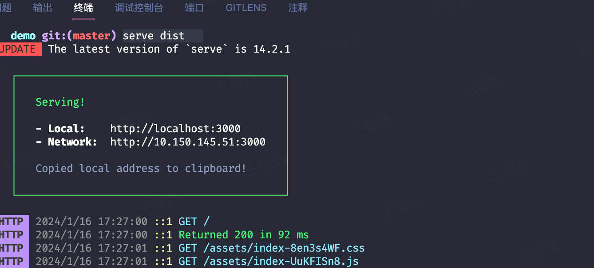
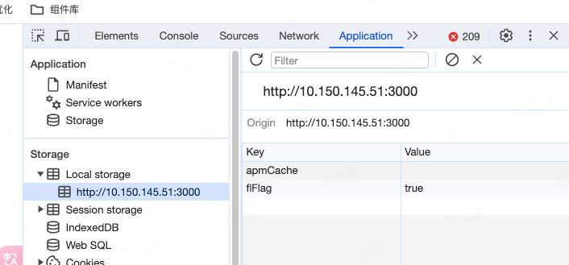
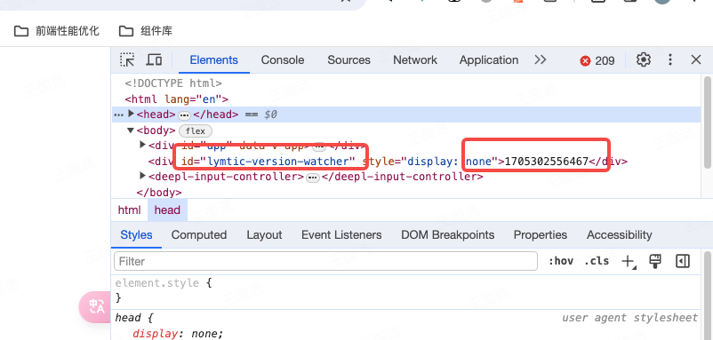

#### demo 介绍

为了体验库：@lymtic/version-watcher 而实现的小案例

#### 使用

##### 依赖安装

```bash
npm i
```

##### 项目构建

```bash
npm run build
```

##### 本地服务器模拟实现效果

```bash
npm i serve -g
```

将 `dist` 目录作为根目录启动本地服务器

```bash
serve dist
```

启动预览：


运行成功效果：


复现弹窗：

- 检查 `localStorage` 是否存在 `versionInfoExpireTime` ，存在则将其删除
  

- 找到 `Element` 内存储版本的元素，将其版本号修改为小于 `version.json` 内存储的版本号
  

- 现在切换 tab 页之后再切换回来，即可看到预览效果
  
